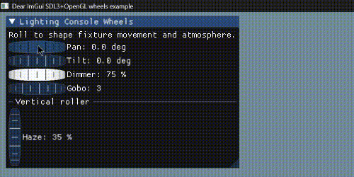

# imgui-wheels

3D barrel-style wheel widgets for Dear ImGui.

Why was this created? Because I was working on a personal application and wanted virtual encoders/wheels like the Avolites PC Suite has. However, nothing already existed that functioned this way, so with a little inspiration from imgui-knobs I decided to create my own widget. I also knew I would probably need this in the future for other projects, so I decided to make it public.



## Build Example

### Prerequisites

1. Visual Studio 2022 with Desktop C++ tools.
2. CMake (for building SDL).

### Get dependencies

Initialize submodules (SDL is pinned as a submodule):

```powershell
git submodule update --init --recursive
```

### Build SDL (Windows)

From the repository root:

```powershell
# Win32
cmake -S external/SDL -B external/SDL/build-win32 -A Win32
cmake --build external/SDL/build-win32 --config Release --target SDL3-shared

# x64
cmake -S external/SDL -B external/SDL/build-x64 -A x64
cmake --build external/SDL/build-x64 --config Release --target SDL3-shared
```

### Build the example app (Windows, MSVC)

Use a Visual Studio Developer Command Prompt (or run `vcvars32.bat` / `vcvars64.bat` first), then:

```powershell
cd example

# Win32 (builds Debug and Release)
./build_win32.bat

# x64 (builds Debug and Release)
./build_win64.bat
```

The scripts default `SDL3_DIR` to `external/SDL` automatically. You can override it if needed:

```powershell
set SDL3_DIR=C:\path\to\SDL
```

### Run

From `example`:

```powershell
Debug\example_sdl3_opengl3.exe
# or
Release\example_sdl3_opengl3.exe
```

### Output binaries

- `example/Debug/example_sdl3_opengl3.exe`
- `example/Release/example_sdl3_opengl3.exe`

Architecture-tagged copies may also exist if you created them while testing:

- `example/Debug/example_sdl3_opengl3_win32.exe`
- `example/Debug/example_sdl3_opengl3_x64.exe`
- `example/Release/example_sdl3_opengl3_win32.exe`
- `example/Release/example_sdl3_opengl3_x64.exe`

### Credits

Credits to the team behind ImGui-knobs for a "template" to start from. ImGui-Knobs for cpp can be found here: https://github.com/altschuler/imgui-knobs